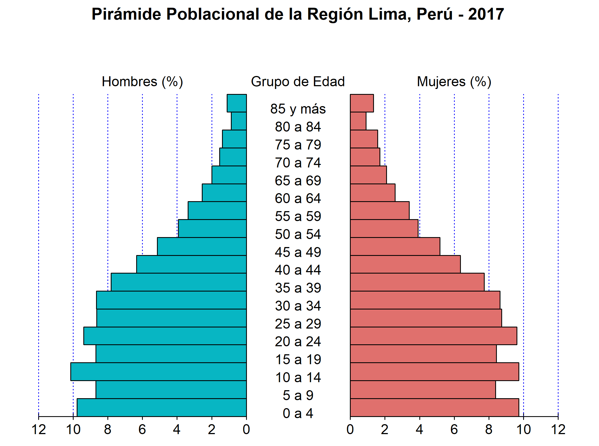
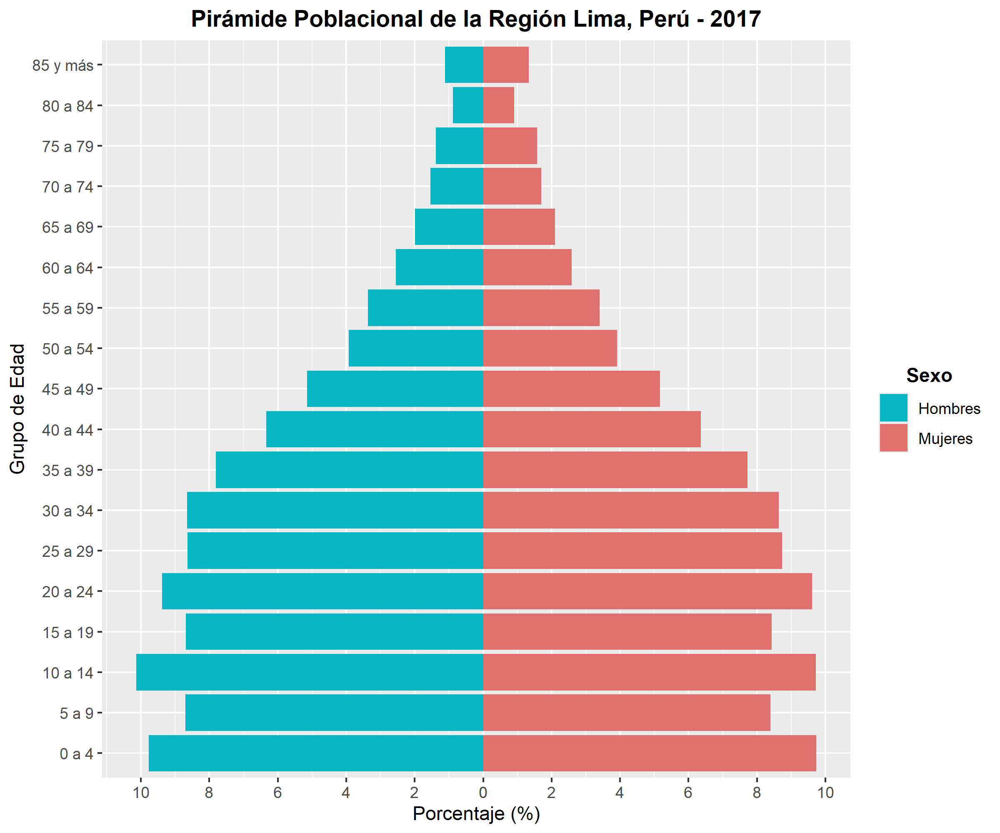

## Pirámides de Población

Las pirámides poblacionales, también denominadas pirámides demográficas, son representaciones gráficas de la estructura de una población, clasificados por sexo y grupos etarios, en un espacio geográfico y período determinados. Estas representaciones adoptan la forma de un doble histograma horizontal, en el que los datos suelen agruparse en intervalos quinquenales (0–4, 5–9, 10–14, etc.). Convencionalmente, la población masculina se dispone a la izquierda del eje central y la población femenina a la derecha.

De acuerdo con la forma que adopte, la pirámide poblacional se clasifica en cinco tipos:

- Pirámide Progresiva (Creciente, Triangular o Expansiva): Se caracteriza por una base amplia, mientras que las secciones medias y superiores son más estrechas. Este tipo de pirámide refleja una mayor proporción de población juvenil en comparación con la adulta.

- Pirámide Estacionária (Estancada, Equilibrada o Campaniforme): Se caracteriza por una base y una parte media de amplitud similar, mientras que la sección superior es más estrecha. En este tipo de pirámide, la proporción de población juvenil y adulta es comparable.

- Pirámide Regresiva (Decadencia, Bulbo o Rombo): Se caracteriza por una base y una parte superior más estrechas en comparación con la sección media, que es más amplia. Este tipo de pirámide refleja una mayor proporción de población adulta en relación con los juveniles.

- Pirámide Invertida: Se caracteriza por una base y una parte media más estrechas en comparación con la sección superior, que es más amplia. Este tipo de pirámide refleja un proceso de envejecimiento progresivo de la población. Aunque podría considerarse un subtipo de las pirámides regresivas, a menudo se describe como una categoría distinta debido a su enfoque particular en el envejecimiento poblacional.

- Pirámide Desequilibrada: Este tipo de pirámide se presenta cuando existe una desproporción, principalmente en la distribución por sexo. No se reconoce ampliamente como una categoría independiente, pero podría considerarse una variación de cualquiera de los tipos anteriores, dependiendo de las circunstancias particulares de la población que se está analizando.

Las pirámides poblacionales son herramientas fundamentales en el análisis demográfico, ya que permiten identificar tendencias clave como el crecimiento de la población, el envejecimiento demográfico y las tasas de natalidad y mortalidad. Estos gráficos no solo ofrecen una representación visual clara de la estructura poblacional, sino que también juegan un papel crucial en la formulación de políticas públicas. Al proporcionar información sobre las proyecciones de población, permiten anticipar las necesidades futuras en áreas como infraestructura, educación, salud y empleo, lo que contribuye a una planificación más eficiente y contribuye al bienestar social de las comunidades.

En esta oportunidad, les comparto una serie de códigos en R que permiten graficar pirámides poblacionales de manera sencilla y personalizable, con el uso de las librerias "pyramid" y "ggplot2".

RPubs: https://rpubs.com/delacruz-renzo/piramide-poblacional
